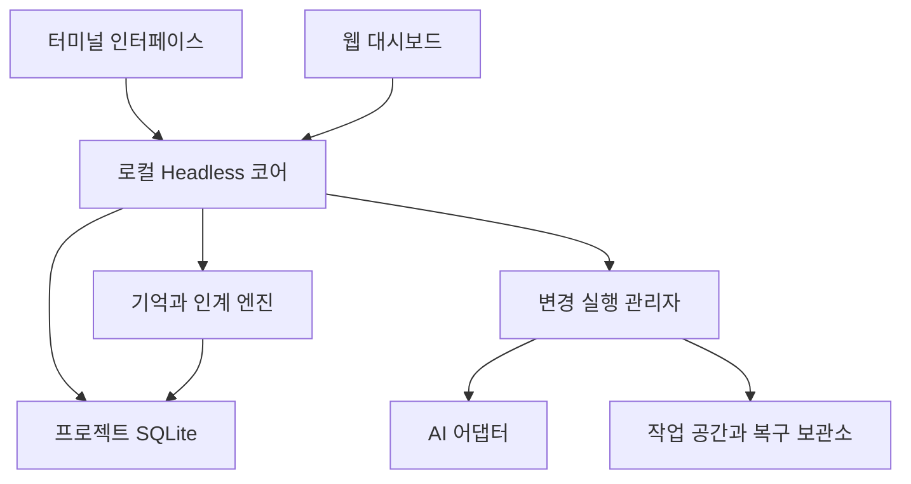
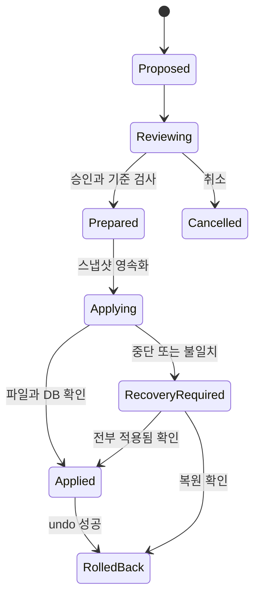

# Talo 제품 재기획 및 기술 설계 v0.2

- 작성일: 2026-09-05
- 상태: 구현을 위한 설계안. 이 문서의 목표 기능을 구현 완료로 간주하지 않는다.
- 대상 저장소: `ryujish/talo`
- 기준 작업 폴더: `/Users/choisunghoon/Documents/Aitime/Talo`
- 웹 UI·기획 기준 폴더: `/Users/choisunghoon/Documents/Aitime/think-along_start` (사용자 지정)
- 확인한 HEAD: `4b31577`. 작업 트리에 추가 수정·미추적 파일이 있어 HEAD만으로 현재 코드를 재현할 수는 없다.
- 이번 범위: 제품 방향, 사용자 흐름, 아키텍처, 데이터·API 계약, 패치·복구, 배포, 이전 계획, 검증 기준.

## 1. 제품 결정

**Talo는 AI가 바뀌거나 하루가 지나도 프로젝트를 다시 설명하지 않고 이어서 작업하도록 돕는 개발 작업 공간이다.**

첫 대상은 AI 코딩 도구를 이미 사용하며 며칠에 걸쳐 프로젝트를 진행하는 개인 개발자와 소규모 제작자다. 여러 사람이 각자 쉽게 사용하는 경험을 먼저 검증한다. 팀 공동 편집·권한 관리는 후속 범위다.

제품의 첫 화면은 모델 목록이 아니라 프로젝트의 마지막 상태다. 사용자가 얻어야 할 결과는 다음 세 가지다.

1. 설치와 설정에 시간을 쓰지 않고 첫 작업을 시작한다.
2. 무엇이 바뀌는지 이해하고, 잘못된 변경은 자신의 기존 작업을 잃지 않고 되돌린다.
3. 다음 실행 때 목표·결정·남은 일·검증 결과를 정확하게 이어받는다.

시장성·사용성은 아직 검증되지 않았다. 아래 지표는 관측된 성과가 아닌 출시 판단을 위한 제안 기준이다.

## 2. 현재 근거와 개선 범위

현재 저장소의 텍스트·코드를 읽어 확인했다. 이번 작업에서 설치 실험, 화면 조작 감사, 테스트 전체 재실행, 사용자 인터뷰는 수행하지 않았다.

아래 현재 CLI 진단은 Talo 기준이다. 웹 구현·UX 재사용 기준은 사용자가 지정한 `think-along_start`다. Talo 루트의 잔존 웹 코드를 최신 웹 기준으로 취급하지 않는다. 두 폴더가 자동 동기화된다는 가정도 하지 않는다.

| 항목 | 확인한 근거 | 현재 해석 | 목표 |
| --- | --- | --- | --- |
| 설치 | `README.md`, `cli/pyproject.toml` | README에 npm 설치와 Python venv가 함께 등장. CLI 패키지는 Python 3.12 이상을 명시 | 사용자에게 Python·Node 설정을 요구하지 않는 설치 |
| 웹·CLI 상태 | `lib/server/db.ts`, `cli/src/talo/paths.py` | 웹 `data/db.json`, CLI 프로젝트별 `state.sqlite`로 분리 | 동일한 로컬 코어와 프로젝트 상태 사용 |
| 패치 | `cli/src/talo/tools/builtin.py:file_patch` | 해시 확인, 정확한 단일 치환, 원자적 파일 교체 존재. 미일치·중복은 실패 | 제한된 Fuzzy 후보 탐색과 재생성 루프 |
| 재개 품질 | `context/engine.py:compact`, `runtime/loop.py` | 오래된 메시지 일부 미리보기 기반 축약. 일반적인 `next_actions` 생성 | 근거가 있는 목표·결정·구체적 미완료 작업 보존 |
| 변경 검토 | `cli/interactive.py`의 `/diff` 처리 | `diff_stat()` 요약 출력 확인 | 실제 패치 단위 검토·수정 요청·취소 |
| 체크포인트 | `storage/db.py` | checkpoints 테이블 존재 | 파일 바이트 복구와 장애 복구가 검증된 `/undo` |
| 연결 | `providers/cli_subprocess.py` | 실행 파일·인증 파일 점검, 외부 CLI subprocess 실행 | 설치·인증 흔적·실제 응답·통제 가능 범위 분리 |

Node와 Python이 모든 CLI 사용 경로에서 동시에 필수라고 단정하지 않는다. 확인된 문제는 통합 빠른 시작이 두 환경의 설치를 요구하는 점이다. 또한 체크포인트 테이블의 존재만으로 파일 롤백이 완성되었다고 판단하지 않는다.

기존 자동화 설계의 기억 확정·수정·폐기 및 프로젝트 격리 원칙은 유지한다. 기존 문서의 ‘별도 데몬 없음’, ‘웹·CLI 저장소 통합 보류’는 이 설계가 구현되는 단계에서 대체한다. 뉴스레터·범용 메신저·복잡한 다중 에이전트·추가 공급자 대량 확장은 보류한다.

## 3. 핵심 사용자 여정

| 단계 | 사용자 경험 | 내부 완료 조건 | 실패 시 복구 |
| --- | --- | --- | --- |
| 설치 | 한 줄 설치 후 `talo` 실행 | 외부 Python·Node 없이 시작 | 아키텍처·서명·패키지 진단 제공 |
| 프로젝트 열기 | 현재 폴더 인식 또는 최근 프로젝트 선택 | 명시적 프로젝트·워크스페이스 ID 확정 | 이동·삭제된 폴더 재연결 |
| AI 연결 | 설치된 지원 CLI 또는 API 연결 선택 | 점검 상태와 마지막 성공 시각 표시 | 실행 파일 누락·인증 실패·응답 실패 별도 안내 |
| 첫 도움 | 최근 변경 설명, 작은 수정 중 선택 | 실제 근거가 있는 결과 제공 | AI 미연결이면 Git 상태 기반 제한 체험 |
| 수정 검토 | 컬러 diff와 이유 확인, 적용·수정 요청·취소 | 정확한 변경 묶음에 승인 결합 | 외부 수정 시 미리보기 갱신 |
| 작업 종료 | 완료·미완료·검증·다음 행동 표시 | 구조화된 인계 영속화 | 요약 실패 시 원본 이벤트로 최소 인계 |
| 다음 날 재개 | 마지막 상태와 ‘이어서 하기’ | 현재 파일 상태와 인계 상태 비교 | 오래된 검증·변경된 브랜치 표시 |
| AI 변경 | 같은 목표·제약을 새 AI에 전달 | 새 실행에 동일한 인계 버전 기록 | 실패한 도구 작업을 자동 중복 실행하지 않음 |

온보딩에서 모델 ID, API 프로토콜, MCP 주소는 고급 설정으로 둔다. 기존 연결이 여러 개면 마지막 성공 연결을 제안하고 사용자가 선택하게 한다. 비용이 드는 응답 점검은 연결 시험 동작에 포함된다는 것을 알리고 짧은 호출 한 번으로 제한한다.

재개 화면은 ‘목표 / 마지막 완료 / 남은 일 / 검증 / 다음 행동’ 다섯 항목을 기본으로 한다. 근거가 없으면 ‘확인되지 않음’으로 표시한다. 프로젝트 파일의 지시문을 사용자 승인이나 실행 권한으로 승격하지 않는다.

## 4. 아키텍처 결정

### 4.1 단일 로컬 코어

Python 도메인 코드를 유지하고, 이를 사용하는 로컬 Headless 서비스 `talo serve`를 만든다. 터미널과 웹은 같은 서비스 계약을 호출한다. 웹 브라우저가 SQLite 파일을 직접 여는 방식은 사용하지 않는다.

| 계층 | 책임 | 금지할 중복 |
| --- | --- | --- |
| CLI·TUI | 입력, 재개 요약, diff 검토, 진행 상태 | DB 직접 변경·독자적인 승인 판정 |
| 웹 | 프로젝트 상태, 결정 이력, 승인 Inbox, 세션 타임라인 | 모델 직접 실행·별도 작업 DB |
| Application Service | 유스케이스, 요청 멱등성, 프로젝트 범위 확인 | 프레임워크에 결합된 업무 규칙 |
| Runtime | 실행 수명주기, 취소, 어댑터 호출 | 실패 요청의 무조건 재실행 |
| Change Manager | 후보 패치, 승인, 체크포인트, 적용·undo | 사용자 기존 수정의 일괄 초기화 |
| Storage | 트랜잭션, 이벤트 순서, 조회 모델 | UI별 상이한 상태 생성 |

### 4.2 서비스 수명과 동시성

- OS 사용자별 코어 프로세스 하나. Unix socket과 소유자 전용 잠금으로 중복 시작을 방지한다.
- `talo`는 서비스 상태를 확인해 필요하면 자동 기동한다. `talo serve`는 명시적 foreground 실행, `talo stop`은 정상 종료에 사용한다. 모두 목표 명령이다.
- 브라우저 API와 정적 파일은 동일한 loopback origin에서 제공한다. 기본 외부 바인딩은 하지 않는다.
- DB 쓰기는 코어의 프로젝트별 직렬 큐가 담당한다. SQLite WAL은 유지하되 WAL만으로 실행 순서가 보장된다고 가정하지 않는다.
- 같은 workspace의 파일 변경·undo는 하나씩 수행한다. 다른 worktree는 별도 workspace로 분리한다.
- 읽기·모델 호출 동안 긴 DB 쓰기 트랜잭션을 유지하지 않는다. 대기 한도를 넘으면 재시도 가능한 `BUSY`를 반환한다.
- 서비스 종료 시 새 변경을 받지 않고 진행 중인 적용을 마무리하거나 복구 필요 상태로 남긴다. GUI 종료는 실행 취소로 취급하지 않는다.
- 구버전 CLI의 직접 쓰기는 전환 후 막는다. CLI와 서비스 프로토콜 버전이 맞지 않으면 업데이트를 안내한다.

### 4.3 저장 범위

| 위치 | 저장할 데이터 |
| --- | --- |
| `~/.talo/registry.sqlite` | 로컬 프로젝트 등록과 경로 연결. 재구성 가능한 색인 |
| `~/.talo/projects/<project-id>/state.sqlite` | 세션·실행·기억·작업·승인·변경·체크포인트 메타데이터·이벤트 |
| `~/.talo/projects/<project-id>/artifacts/` | 복구용 파일 바이트, 큰 로그, diff 및 증거 자료 |
| `~/.talo/config.toml` | 사용자 설정 및 자격증명 참조 |
| OS 자격증명 보관소 | API 비밀값. 지원 불가 환경의 저장 방법은 별도 명시 |
| 프로젝트 `.talo/project.toml` | 프로젝트 식별자와 공유 가능한 기본 설정 |

‘단일 상태’는 모든 프로젝트를 한 DB로 합친다는 뜻이 아니다. 각 프로젝트의 권위 있는 상태를 하나로 유지한다는 뜻이다. worktree별 실행·체크포인트·승인은 분리하고, 공통 프로젝트 결정에는 적용 범위를 붙인다. 별도로 복제된 저장소는 경로가 비슷하다는 이유로 자동 병합하지 않는다.

### 4.4 웹 기준 프로젝트와 재사용 결정

웹 참조 원본은 `/Users/choisunghoon/Documents/Aitime/think-along_start`로 확정한다. 해당 폴더의 `docs/PROJECT_CONTEXT.md`, `docs/ARCHITECTURE.md`, `docs/UI_IA.md`, `app/page.tsx`의 연결 지점, 대시보드 컴포넌트의 상태·API 처리 부분을 확인했다. 전체 UI를 실행해 검증한 것은 아니다.

| 웹 참조의 요소 | 관측한 내용 | Talo 적용 |
| --- | --- | --- |
| `docs/UI_IA.md`의 Project Home | 최근 세션·현재 상태·미해결·이어가기 중심 | 재개 화면의 기본 구조로 채택 |
| `app/page.tsx`의 DesktopContext | context·decision·skills·journey 영역 | 목표·결정·근거·타임라인으로 축소해 활용 |
| `components/dashboard/AutomationDashboard.tsx` | overview/list/detail/timeline/audit, 승인·반려 동작 | 프로젝트 개요·작업 목록·변경 승인·세션·감사 이력으로 전환 |
| 동일 컴포넌트의 `/api/automations` 호출 | 초기 조회와 변경 후 snapshot 재조회 | 코어 snapshot API와 SSE 구독으로 교체 |
| 동일 컴포넌트의 지표 | `todayExecutions: 24`, `savedHours: 14.5` 고정값 존재 | 실제 이벤트로 계산 가능한 지표만 노출. 절약 시간 근거 없으면 숨김 |
| `lib/server/db.ts` | 웹 참조도 `data/db.json` 저장 | 가져오기 대상 후보로 분리 등록, 코어가 단일 writer |
| `next.config.ts` | 개발용 API proxy rewrite 지원 | 개발 UI/코어 분리 참고. 배포용 정적 제공 가능성은 별도 검증 |
| `PROJECT_CONTEXT.md` | 세션 독립성·원본 보존·수동 모델 전환 | 연속성 계약에 계승 |

범용 청구서·이메일·일정 카테고리와 자동화 등록 흐름을 그대로 노출하지 않는다. 승인 화면의 레이아웃과 상태 표현을 재사용하되 승인 대상은 정확한 changeset revision으로 바꾼다. API 형태가 비슷해도 범용 자동화 승인과 코드 변경 승인 권한을 동일시하지 않는다.

참조 프로젝트의 ‘사용자가 선택하지 않은 모델·계정으로 자동 전환하지 않음’ 원칙을 유지한다. 실패 시 대체 연결을 제안하고 사용자가 선택한 뒤 같은 Context로 실행한다. 이 문서의 셀프 힐링은 동일 연결 내의 제한된 패치 재생성이며 자동 provider fallback을 의미하지 않는다.

웹 소스는 구현 단계에서 선택한 컴포넌트·스타일을 Talo의 `web/` 경계로 가져오는 방식을 제안한다. `think-along_start`를 통째로 옮기거나 Talo 루트 웹과 동시에 기능을 개발하지 않는다. 복사 시 원본 경로·버전·변경 범위를 기록한다. 이후 Talo용 변경은 Talo에서 관리하며 두 제품의 서버 DB를 상호 동기화하지 않는다. 이번 작업은 설계 문서 작성이며 참조 웹 소스를 수정하지 않는다.

## 5. 설치 및 패키징

### 5.1 배포 계약

제품 목표 명령은 `brew install talo`다. 이는 현재 배포 가능하다고 확인된 명령이 아니다. Homebrew 등록과 이름 사용 가능 여부는 배포 단계에서 검증해야 한다. 초기에는 자체 tap의 완전한 수식 이름을 사용하는 한 줄 설치로 제공할 수 있다. tap 이름도 실제 등록 후 문서화한다.

초기 macOS arm64를 우선 검증하고 x86_64를 별도 산출물로 추가한다. 최소 macOS 버전은 빌드 실험 전 확정하지 않는다. Linux·Windows는 별도 출시 게이트로 분리한다.

### 5.2 기술 선택

- 기존 Python 코어와 의존성을 독립 실행 패키지에 포함한다. Rust·Go 전면 재작성은 초기 범위에서 하지 않는다.
- 사용자에게 노출되는 명령은 하나다. Homebrew 패키지 내부의 런타임·정적 자산 디렉터리는 허용한다.
- 엄격한 단일 파일 실행 산출물도 패키징 실험 대상으로 둔다. 시작 지연·임시 추출·서명 문제를 평가하고 배포 형식을 확정한다.
- 패키징 도구·버전은 아직 확정하지 않는다. 의존성 번들링, SQLite 기능, TLS 인증서, 동적 import, 터미널 입력과 subprocess를 포함한 실험을 통과한 후보를 고정한다.
- 웹은 빌드된 정적 자산을 동봉한다. 기존 Next.js 서버 API와 SSR 의존 화면은 코어 API 기반으로 전환한다. 현재 웹이 설정 하나로 정적 export 된다고 가정하지 않는다.
- Node는 웹 개발·빌드 환경에만 남긴다. Python은 개발 환경과 패키지 내부에 남긴다.
- 외부 Codex·AGY·OpenCode CLI를 선택하면 해당 제품 자체 설치·로그인·런타임 요구는 별도로 존재할 수 있다. Talo 단일 패키지가 이를 없애지는 않는다.
- AI 연결 없이 실행되는 로컬 예제와 Git 상태 체험을 포함한다. 실제 AI 작업은 유효한 연결이 필요하다.

### 5.3 출시 파이프라인

소스 버전 고정 → 잠긴 의존성으로 플랫폼별 빌드 → 포함 자산·라이선스·SBOM 생성 → 체크섬·서명 → 깨끗한 머신 설치 → 기존 상태 업그레이드 검증 → 배포 채널 게시 순서로 진행한다. Homebrew 설치본의 업데이트는 Homebrew가 담당한다.

출시 통과 기준: 사용자 Python·Node가 없는 환경에서 설치·`talo --version`·프로젝트 열기·로컬 체험·대시보드 열기·재실행 성공. 실제 지원 어댑터 연결은 별도 환경에서 검증한다. 시작 시간 목표는 대표 프로젝트에서 p95 2초 이내이며 모델 응답 시간을 제외한다. 목표값은 측정 후 조정한다.

## 6. 프로젝트 상태·기억·인계

### 6.1 인계 v0.2 계약

| 필드 | 내용 | 근거 규칙 |
| --- | --- | --- |
| `schema_version` | 인계 형식 버전 | 알려진 버전만 수용 |
| `project_id`, `workspace_id`, `session_id` | 대상 식별자 | 현재 작업 공간과 일치 |
| `goal` | 현재 사용자 목표 | 사용자 메시지 참조 |
| `constraints` | 변경 범위·금지사항 | 확정된 지시의 출처·버전 |
| `decisions` | 결정과 이유, 적용 범위 | 확정/제안/폐기 상태 분리 |
| `completed_tasks` | 완료 작업 ID | 완료 조건과 증거 연결 |
| `open_tasks` | 구체적 미완료·차단 작업 | 대상 경로, 다음 행동, 완료 조건 |
| `workspace_state` | HEAD, branch, index·working tree 상태 식별 | 관측 시각과 해시 포함 |
| `verification_refs` | 명령·종료 코드·로그·대상 상태 | 실제 실행 결과만 성공 표시 |
| `unknowns` | 미확인 정보 | 생성한 확신 점수로 대체하지 않음 |
| `next_action` | 바로 할 수 있는 작업 | 열린 task를 참조, 없으면 비워 둠 |
| `source_event_cursor` | 반영한 마지막 이벤트 | 부분 요약의 범위 명시 |
| `previous_handoff_id` | 이전 인계 | 삭제 대신 이력 연결 |

모델이 구조화 정보를 제안하고, 스키마·출처·작업 상태 일관성을 코어가 검증한다. 모델 제안만으로 사용자 결정을 확정하지 않는다. 사용자가 기억을 고치면 새 버전을 만들고 이전 인계는 역사로 남긴다.

### 6.2 컨텍스트 구성

확정 목표·필수 제약 → 현재 미완료 작업 → 관련 결정 → 최근 검증 → 관련 코드 → 최근 대화 순으로 배정한다. 필수 제약이 예산을 초과하면 조용히 잘라내지 않고 범위 축소를 요청한다. 도구 호출과 결과의 짝을 보존한다.

원본 메시지는 보존한다. 요약은 파생 데이터이며 출처 범위와 누락 목록을 갖는다. 실패하면 최근 확인된 인계와 원본 이벤트에서 결정적으로 추출한 상태를 사용한다. 파일 변경 후 과거 테스트 성공은 `stale`로 보여주며 최신 성공처럼 표시하지 않는다.

AI 전환 시 새 run과 connection에 동일한 인계·정책 버전을 전달한다. 이전 run의 실행 중 도구는 `unknown_outcome` 여부를 확인한 뒤 처리한다. 권한·모델 능력·토큰 예산이 다르면 차이를 표시한다. 기억은 모델이 제안한 텍스트를 통해 권한을 확대할 수 없다.

## 7. Fuzzy Patch와 셀프 힐링

### 7.1 변경을 먼저 제안하고 나중에 적용

현재 `file_patch`의 즉시 쓰기 경로를 `propose_change`와 `apply_change`로 분리한다. `file_write` 등 모든 코어 파일 변경도 같은 Change Manager를 거친다. 패치 한 묶음은 여러 파일을 포함할 수 있으며 검토 시점에는 원본 workspace를 변경하지 않는다.

입력 계약: `workspace_id`, `run_id`, `base_hash`, 상대 경로, 작업 종류, 이전 내용/문맥, 새 내용, 변경 이유. 출력 계약: `change_id`, `revision`, 후보 diff, 변경 전후 해시, 매칭 방식, 검증 상태, 오류 코드.

### 7.2 매칭 단계

| 단계 | 처리 | 원칙 |
| --- | --- | --- |
| 0 | 경로·파일 유형·인코딩·기대 해시 검사 | 범위 이탈, 심볼릭 링크 우회, 오래된 기준 차단 |
| 1 | 정확한 단일 문맥 일치 | 기존의 안전한 단일 치환 활용 |
| 2 | 줄바꿈 차이 등 제한 정규화로 후보 탐색 | 후보 위치만 찾고 원본 바이트 형식 보존 |
| 3 | 주변 고유 anchor와 줄 단위 유사도로 후보 순위 | 유사도만으로 자동 적용하지 않음 |
| 4 | 최신 문맥을 다시 읽고 패치 재생성 | 명확한 후보가 없으면 중단 |

Python 들여쓰기, 문자열 내부 공백, YAML 구조 등 의미가 달라질 수 있는 공백은 일괄 제거하지 않는다. 후보가 여러 곳이면 가장 높은 점수를 임의로 적용하지 않는다. 초기 릴리스에서는 Fuzzy 경로로 생성된 변경은 반드시 새 diff 검토를 거친다. confidence는 위치 유사도의 보조 정보이며 의미적 정확성 보장이 아니다.

기대 해시가 달라지면 Fuzzy를 이용해 오래된 승인을 재사용하지 않는다. 파일 재조회 후 새로운 변경 revision을 만든다. 후보 탐색은 기본적으로 지정 파일에 한정하고 탐색 파일·바이트·시간 상한을 둔다.

### 7.3 셀프 힐링 루프

정확한 적용 실패 → 실패 원인 분류 → 관련 최신 코드·중복 후보·해시 전달 → 수정된 패치 생성 → 격리 공간에서 검증 → 새 diff 검토 순서다. 초기 정책은 재생성 최대 2회, 루프 총 60초, 모델 입력·출력 예산은 실행 예산 안에서 제한한다. 모두 초기 설계값이다.

- `STALE_BASE`: 최신 파일 재조회 후 생성. 기존 승인 무효화.
- `NO_MATCH` / `AMBIGUOUS_MATCH`: 인접 문맥 또는 고유 anchor 보강.
- `PARSE_FAILED` / `CHECK_FAILED`: 관련 오류와 변경 범위를 모델에 전달.
- `POLICY_DENIED` / `PATH_ESCAPE`: 자동 재시도하지 않음.
- 같은 후보 해시 반복, 예산 소진, 사용자 취소: 현재까지의 diff와 이유를 남기고 종료.

테스트 실패가 기능 변경의 정당성을 자동 부정하는 것은 아니다. 코어는 실패 원인을 보여주고 수정·취소를 제공한다. 정책상 필수 검증 실패는 적용을 막고, 선택 검증은 미통과 상태를 명시한다. 자동으로 테스트를 삭제하거나 권한을 높여 성공시키지 않는다.

## 8. Interactive Diff와 체크포인트 롤백

### 8.1 터미널 인터랙션

`/diff`는 변경 파일 목록과 실제 unified diff를 제공한다. 터미널 컬러 외에도 `+/-`와 상태 텍스트를 함께 표시하고, 좁은 화면·비TTY·색상 비활성 환경도 지원한다.

| 동작 | 결과 |
| --- | --- |
| 검토 화면 진입 | 파일, 변경 이유, 삽입·삭제 수, 검증 상태 표시 |
| 적용 선택 후 Enter | 현재 revision에만 승인, 체크포인트 생성 후 적용 |
| 수정 요청 | 자연어 요구 반영 후 새 revision 생성 |
| 취소 또는 Esc | 원본 변경 없이 후보 종료 |
| `/undo` | 마지막 적용 변경 묶음을 검사하고 충돌 없으면 복원 |

기본 포커스는 ‘검토 계속’에 둔다. 엔터 한 번으로 적용하려면 사용자가 적용 동작을 선택한 상태여야 한다. 이미 부여한 권한은 범위·수명이 유효하면 유지하고 동일 작업 승인을 반복해서 요구하지 않는다. 초기에는 변경 묶음 전체 적용을 기본으로 하고 hunk 부분 적용은 후속 단계로 둔다.

### 8.2 체크포인트 정의

체크포인트는 Git commit이나 `git stash`에 의존하지 않는 작업 전 파일 스냅샷이다. Git 없는 폴더에서도 동작하도록 설계한다. 저장소 밖 복구 보관소에 내용 주소형 blob과 manifest를 둔다.

manifest에는 workspace ID, change ID/revision, 상대 경로, 파일 존재 여부, 변경 전후 SHA-256, 원래 파일 모드, blob 참조, 기준 HEAD·브랜치, 생성 시각을 기록한다. 생성·수정·삭제를 지원한다. rename은 초기에는 삭제+생성으로 표현한다. 심볼릭 링크·서브모듈·특수 파일 변경은 초기 지원에서 제외하고 명시적으로 차단한다.

사용자에게 보이는 diff는 `HEAD` 대비 전체 변경과 ‘이번 Talo 변경’을 구분한다. Talo 변경의 기준은 실제 변경 직전 파일 바이트다. 기존 staged·unstaged·untracked 작업을 스냅샷에 반영하되 Git index는 건드리지 않는다. 자동 commit·stash·reset·clean을 실행하지 않는다.

### 8.3 적용과 장애 복구

1. workspace 변경 잠금을 얻고 HEAD·파일 해시·revision·승인을 다시 확인한다.
2. 변경 전 blob과 manifest를 기록하고 필요한 fsync를 완료한다.
3. DB에 `prepared` 및 journal을 커밋한다. 승인 소비와 실행 의도는 같은 DB 트랜잭션으로 기록한다.
4. 동일 파일시스템의 임시 파일을 이용해 파일별 교체·삭제를 진행하며 journal에 진행 상태를 남긴다.
5. 모든 변경 후 해시를 확인하고 `applied`와 이벤트를 DB에 커밋한다.

여러 파일 변경과 SQLite 갱신 전체가 하나의 원자적 트랜잭션이라고 가정하지 않는다. 재시작 시 각 파일이 before/after/다른 내용 중 무엇인지 판정해 복구한다. 모두 after면 완료 처리, before/after가 섞였으면 알려진 상태만 복구하며, 제3의 내용이 있으면 자동 덮어쓰기를 멈춘다. 복구 중인 workspace의 새 변경은 차단한다.

외부 편집기는 Talo 잠금을 따르지 않을 수 있다. 적용 직전·직후 해시 확인과 파일 변경 감시로 충돌을 감지하지만, 임의의 외부 프로세스와 완전한 원자적 교환을 보장하지는 않는다. 변경이 계속 감지되면 적용을 중단하고 사용자에게 해당 파일 저장을 마친 뒤 재시도하도록 안내한다.

### 8.4 `/undo` 계약

- 최신 `applied` 변경 묶음만 기본 대상으로 한다. 적용 이후 같은 파일이 바뀌었는지 after 해시로 검사한다.
- 충돌이 없으면 한 동작으로 before 상태를 복원한다. 새로 생성한 파일은 기대 해시가 맞을 때만 제거한다.
- 충돌이 있으면 파일별 diff와 복구 후보를 제시한다. 사용자의 이후 수정은 보존한다. 자동 강제 롤백은 없다.
- 브랜치·worktree가 달라지면 즉시 복원하지 않고 원래 작업 공간을 확인한다.
- undo 자체도 복구 journal을 갖고, 파일 복구 완료 후 상태와 이벤트를 기록한다. 중복 요청은 이미 수행한 결과를 반환한다.
- 코드에 종속된 검증은 오래된 상태로 전환한다. 과거 실행 이력은 지우지 않고 현재 작업 상태를 재계산한다. 사용자 결정 전체를 과거로 되돌리지 않는다.
- 외부 API 요청, 메시지 전송, 패키지 설치, DB 변경 같은 명령의 부작용은 `/undo` 대상이 아니다. 실행 전에 복구 범위를 표시한다.
- 초기 보존 기본값은 프로젝트당 최근 50개 또는 30일이며 용량 한도와 함께 설정 가능하게 한다. 미완료 복구·승인 대기에서 참조하는 blob은 정리하지 않는다. 디스크 부족 시 복구 자료 없이 적용하지 않는다.

## 9. 외부 CLI와 실행 통제

외부 AI CLI가 실제 프로젝트에서 직접 파일을 수정하면 Talo의 사전 diff 승인·checkpoint 계약을 우회할 수 있다. 어댑터의 출력 스트리밍만으로 이를 해결했다고 보지 않는다.

| 어댑터 유형 | 실행 방식 | 변경 보장 |
| --- | --- | --- |
| 모델 API | 모델이 제안한 도구를 Talo가 실행 | 모든 파일 변경을 Change Manager로 통제 |
| 격리 가능한 외부 CLI | 임시 복제 작업 공간에서 실행, 결과 diff 추출 | 원본 적용은 Talo 승인·체크포인트 경유 |
| 통제 불가능한 외부 CLI | 초기 관리 모드에서 변경 실행 차단 | 연결은 표시하되 안전한 편집 지원 여부를 별도 표시 |

격리 공간은 현재 사용자의 dirty tree를 기준으로 만들고, staged 상태·untracked 포함 정책을 기록한다. ignored 비밀 파일은 자동 복제하지 않는다. 필요한 환경 파일은 제한된 경로·권한으로 주입한다. 외부 CLI 실행 종료 뒤 생성·삭제·수정 결과를 목록화하고 범위·파일 유형을 검사해 후보 changeset으로 변환한다.

작업 디렉터리를 임시 폴더로 바꾸는 것만으로 보안 격리가 되지는 않는다. 원본 경로와 홈의 다른 파일에 대한 쓰기를 막을 수 있는 실행 제한을 플랫폼별로 검증해야 한다. 지원할 수 없으면 ‘완전한 사전 검토’ 기능을 제공한다고 표시하지 않는다. Git worktree 생성에 따른 저장소 메타데이터 영향도 검토한다.

기존 어댑터에서 관측한 AGY 권한 생략 플래그를 새 관리 모드의 기본값으로 이어받지 않는다. 실제 지원 플래그·로그인 확인 명령·버전 호환성은 어댑터별 실측으로 확정한다. 이 문서에서는 최신 외부 CLI 옵션을 새로 보증하지 않는다.

## 10. 데이터 모델 확장

기존 `sessions`, `runs`, `messages`, `events`, `operations`, `checkpoints`, `handoffs`, `memories`, `verifications`, `approval_requests`를 재사용·확장한다. 아래는 추가 논리 계약이며 바로 실행할 완성 DDL은 아니다.

| 엔티티 | 주요 필드 | 제약 |
| --- | --- | --- |
| `tasks` | id, workspace_id, goal_ref, title, status, next_action, acceptance, evidence_refs, revision | 완료는 증거와 연결. 열린 작업만 재개 후보 |
| `decision_versions` | id, memory_id, version, status, content, source_refs, supersedes | 기억 기록과 중복 권위 금지. decision 종류의 버전 이력으로 사용 |
| `change_sets` | id, workspace_id, run_id, revision, base_state_hash, patch_hash, state | 같은 revision 내용은 불변 |
| `change_files` | change_id, revision, path, operation, before_hash, after_hash, before_blob, after_blob, mode | 경로별 중복 금지, workspace 범위 제한 |
| `patch_attempts` | id, change_id, attempt, match_method, error_code, context_refs, usage | 재시도 상한과 반복 후보 검사 |
| `apply_journal` | operation_id, checkpoint_id, path, phase, expected_hashes | 장애 복구 중 삭제 금지 |
| `checkpoint_files` | checkpoint_id, path, existence, mode, blob_ref, hashes | 기존 checkpoints의 실제 파일 복구 자료 |
| `approval_requests` 확장 | revision, patch_hash, base_hash, policy_version, expires_at, operation_id | 승인 대상을 정확한 변경에 결합 |
| `project_events` | cursor, event_id, workspace_id, type, payload, occurred_at | 프로젝트별 단조 증가 cursor, event_id 유일 |
| `import_records` | source_digest, source_type, source_id, target_id, status | 같은 원본 중복 이전 방지 |

기존 `events.seq`는 세션 범위이므로 그대로 프로젝트 전체 SSE cursor로 사용하지 않는다. 프로젝트 단위 이벤트 순서가 필요하면 `project_events`를 outbox로 추가하고 기존 이벤트를 참조한다. 도메인 변경과 outbox 추가는 같은 트랜잭션에서 처리한다. UI는 조회 모델을 읽으며 이벤트 로그만으로 모든 상태를 재생하는 전면 event sourcing은 초기 범위에 넣지 않는다.

승인 상태는 pending/approved/denied에 expired/consumed/stale을 추가한다. 기존 CHECK 제약 변경은 버전 마이그레이션에서 테이블 재구성·검증으로 처리한다. 동시에 CLI와 웹에서 승인하면 조건부 UPDATE와 고유 operation ID로 한 요청만 소비된다. 승인 후 revision·기준 파일·정책 버전이 달라지면 stale 처리한다.

모든 조회·변경에서 프로젝트와 workspace 소속을 확인한다. 시각은 UTC로 저장하고 표시만 사용자 시간대로 변환한다. 비용·토큰 정보는 실제 측정값과 추정값을 분리한다.

## 11. 로컬 API와 실시간 대시보드

### 11.1 API 계약 초안

프로젝트 데이터 경로는 `/v1/projects/{project_id}` 아래에 둔다. workspace 범위가 필요한 요청은 `workspace_id`를 필수로 받는다.

| 메서드·경로 | 역할 | 쓰기 조건 |
| --- | --- | --- |
| `GET /v1/health` | 서비스·프로토콜 호환 확인 | 최소 상태만 노출 |
| `GET /v1/projects` | 등록된 프로젝트 | 인증 필요 |
| `GET /v1/projects/{p}/resume?workspace_id=...` | 재개 상태와 근거 | 상태 revision 반환 |
| `GET /v1/projects/{p}/snapshot` | 대시보드 상태 일괄 조회 | 일관된 DB snapshot과 cursor 반환 |
| `POST /v1/projects/{p}/runs` | 작업 시작 | request ID·workspace·정책 |
| `POST /v1/projects/{p}/runs/{r}/cancel` | 실행 취소 | run 상태 조건부 전이 |
| `GET /v1/projects/{p}/changes/{c}` | diff·검증 조회 | revision 명시 |
| `POST /v1/projects/{p}/approvals/{a}/decision` | 적용·거절 | revision·patch/base hash 일치 |
| `POST /v1/projects/{p}/changes/{c}/revise` | 수정 요청 | 원 revision 명시 |
| `POST /v1/projects/{p}/workspaces/{w}/undo` | 최신 변경 복구 | expected change ID·after 상태 일치 |
| `GET /v1/projects/{p}/events?after={cursor}` | SSE | 프로젝트별 재접속 cursor |
| `GET /v1/projects/{p}/decisions` | 결정 버전 이력 | 출처·상태 포함 |

쓰기 요청은 `Idempotency-Key`를 사용한다. 같은 키·같은 body는 이전 결과를 반환하고, 같은 키·다른 body는 409로 거절한다. 응답에는 request ID와 상태 revision을 포함한다. 오류는 `code`, `message`, `retryable`, `details`로 통일하고 비밀값을 제거한다.

SSE는 최소 한 번 전달을 전제로 한다. 클라이언트는 event ID로 중복 제거한다. 최초 snapshot의 cursor 이후 이벤트를 구독하고, 재접속은 Last-Event-ID를 사용한다. 보존 범위 밖 cursor는 `resync_required`로 응답해 새 snapshot을 받게 한다. 웹 승인 즉시 성공으로 낙관 확정하지 않고 코어의 승인 결과를 표시한다. 연결이 끊기면 마지막 갱신 시각과 읽기 전용 상태를 보여준다.

### 11.2 화면 구성

기본 화면은 현재 프로젝트의 재개 카드와 최근 활동이다. 보조 탭은 결정 이력, 승인 Inbox, 세션 타임라인으로 제한한다. 각 결정은 근거·수정·폐기 상태를 확인할 수 있어야 한다. 승인 Inbox는 터미널에서 본 것과 동일한 change revision의 diff를 보여준다.

클라우드 웹사이트가 로컬 SQLite에 직접 접근하는 구조는 범위 밖이다. 첫 대시보드는 `talo web`으로 여는 로컬 화면이다. 휴대폰 원격 제어는 인증·접속·기기 승인을 포함한 별도 설계가 필요하다.

### 11.3 로컬 접근 보호

Unix socket과 데이터 디렉터리는 소유자만 접근하도록 한다. 브라우저는 일회성 연결 토큰을 로컬 API 세션으로 교환하고 HttpOnly·SameSite 쿠키를 사용한다. 토큰은 URL fragment에서 즉시 제거하고 쿼리·로그에 남기지 않는다. loopback HTTP와 향후 HTTPS의 쿠키 속성은 분리한다.

Host·Origin 허용 목록과 CSRF 보호를 적용한다. 임의 웹사이트의 localhost 요청과 DNS rebinding을 신뢰하지 않는다. SSE도 같은 인증을 요구한다. API 키·OAuth 토큰·전체 인증 파일을 브라우저나 DB 이벤트로 전송하지 않는다.

## 12. 기존 데이터와 웹 이전

1. **인벤토리:** 실제 `db.json` 타입·버전·사용자 수·프로젝트 연결을 확인한다. 샘플 데이터와 사용자 데이터를 구별한다. 파일 경로만 보고 동일 프로젝트라고 추정하지 않는다.

   기본 웹 참조는 `think-along_start/data/db.json`이다. `Talo/data/db.json`은 별도 레거시 데이터 후보로 취급한다. 어느 파일을 실제 이전할지는 dry-run 결과에 명시하고, 두 파일을 묵시적으로 합치지 않는다. 웹 UI 참고 요청이 참조 프로젝트의 데이터 이전·기존 웹 서비스 종료까지 승인한 것은 아니므로 실제 전환 대상은 구현 작업의 범위로 명시한다.
2. **코어 경계 추출:** CLI의 Application Service를 API로 감싸고 기존 도메인 테스트를 재사용한다. 웹 조회 모델과 API 타입을 먼저 정한다.
3. **SQLite 확장:** 기존 migration SQL을 수정하지 않고 새 버전을 추가한다. 백업, 무결성 검사, 공간 확인, 실패 복구를 제공한다.
4. **dry-run 가져오기:** `talo migrate --dry-run` 목표 명령으로 건수·매핑·충돌·미지원 필드를 보고한다. 기존 users/auth 데이터는 로컬 사용자 모델로 자동 병합하지 않는다.
5. **이전:** 정지한 기존 웹 writer에서 원본 JSON을 보존하고 일관된 SQLite 백업을 만든다. WAL 사용 중인 DB 파일만 단순 복사하지 않는다. 원본 digest와 ID로 중복 이전을 막는다.
6. **매핑:** 기존 웹 thinking/session은 출처가 있는 이전 세션으로, decision은 원래 확정 상태와 출처를 유지해 가져온다. 대응 불명 항목은 미분류 보관으로 남긴다. 실행되지 않은 테스트를 검증 성공으로 만들지 않는다.
7. **전환:** 웹을 코어 API로 바꾸고 JSON 쓰기를 비활성화한다. 비교 기간에는 두 저장소를 읽어 결과를 비교할 수 있으나 이중 쓰기는 하지 않는다.
8. **정적 웹 배포:** 기존 서버 API를 호출하는 화면·인증·SSR 의존을 제거 또는 대체하고 번들에 포함한다.
9. **검증 후 정리:** 건수·핵심 필드·근거·연결 참조를 확인한 뒤 기존 웹 코드의 사용하지 않는 부분을 별도 변경으로 정리한다. 자동 전체 삭제는 하지 않는다.

이전 실패 시 전환 전 백업으로 돌아가되, 전환 후 새 작업이 생긴 경우에는 백업을 그대로 덮어써서 새 기록을 잃게 하지 않는다. 새 이벤트를 보존·내보내기한 후 복구한다. 구버전이 신버전 DB를 열 수 없다면 실행을 막고 데이터 호환성을 설명한다.

## 13. 코드 변경 지도

아래 신규 경로는 제안이다. 구현 단계에서 실제 import·의존 관계를 확인해 세분화한다.

| 기존 경로 | 변경 | 제안 신규 모듈 |
| --- | --- | --- |
| `application/service.py` | UI 공통 유스케이스 경계 확정 | `service/server.py`, `service/api.py`, `service/events.py` |
| `storage/db.py`, `storage/repository.py` | migration·조건부 갱신·outbox | `storage/migrations/`, `storage/project_state.py` |
| `context/engine.py`, `runtime/loop.py` | 구조화 인계와 작업 상태 | `continuity/tasks.py`, `continuity/handoff.py` |
| `tools/builtin.py` | 직접 파일 쓰기를 변경 제안으로 연결 | `changes/proposal.py`, `changes/matcher.py`, `changes/healing.py` |
| `workspace/repo.py` | workspace 잠금·기준 상태 수집 | `changes/checkpoints.py`, `changes/apply.py`, `changes/recovery.py` |
| `cli/interactive.py`, `cli/render.py` | diff 검토와 undo | `cli/diff_review.py` |
| `providers/cli_subprocess.py` | 어댑터 통제 능력·격리 실행 | `providers/capabilities.py`, `execution/isolation.py` |
| `think-along_start/app/`, `components/dashboard/AutomationDashboard.tsx` 등 | 지정 참조에서 화면·스타일을 선택적으로 재사용 | Talo `web/`의 API client와 정적 대시보드 |
| Talo 루트 `app/`, `components/`, `lib/server/db.ts` | 잔존 웹 의존 목록화, 대체 후 정리 | 신규 웹과 중복 실행·저장 차단 |
| `cli/pyproject.toml`, 빌드 설정 | 실행 환경 포함 배포 | `packaging/`, 플랫폼별 release workflow |

## 14. 구현 순서와 완료 조건

단계 이름은 기존 P0/P1/P3 테스트 명칭과 혼동하지 않도록 R0~R5를 사용한다. 기간은 담당 인원과 패키징 실험 전에는 확정하지 않는다.

| 단계 | 산출물 | 완료 조건 | 의존 |
| --- | --- | --- | --- |
| R0 | 코어 API 경계·패키징 실험·기준 시나리오 | 런타임 없는 시작 실험, 기존 저장/실행 경계 목록 | 없음 |
| R1 | 단일 코어·SQLite 확장·작업/인계 v0.2 | 종료·재실행·AI 변경 시 핵심 정보 보존 | R0 |
| R2 | 정확 패치 제안·diff 검토·checkpoint·undo | 기존 사용자 수정 보존, 중간 중단 복구 통과 | R1 |
| R3 | 제한 Fuzzy·셀프 힐링·외부 CLI 격리 | 오위치 적용 차단, 재시도 상한, 원본 통제 검증 | R2 |
| R4 | 로컬 웹·SSE·JSON 이전 | CLI/웹 상태 일치, 중복 승인 실행 없음 | R1~R3 |
| R5 | 패키지 배포·온보딩·사용자 검증 | 깨끗한 설치와 다음 날 재사용 실험 통과 | R0~R4 |

첫 수직 슬라이스는 하나의 모델 API 연결로 ‘프로젝트 열기 → 작은 변경 → diff 적용 → 종료 → 재개 → undo’까지 완성한다. 이후 외부 CLI와 웹에 같은 계약을 확장한다. Fuzzy를 정확 패치·복구 기반보다 먼저 출시하지 않는다.

## 15. 검증 계획

### 15.1 기술 수용 테스트

| 시나리오 | 필수 결과 |
| --- | --- |
| Python·Node 없는 사용자 환경 | 패키지 설치와 CLI·로컬 웹 시작 성공 |
| 동일 문맥이 여러 함수에 존재 | 임의 위치 자동 적용 없음 |
| CRLF·유니코드·의미 있는 들여쓰기 | 바이트 형식·의도하지 않은 영역 보존 |
| 잘못된 인코딩·심볼릭 링크·경로 이탈 | 변경 전 명확한 실패 |
| 검토 후 외부 파일 저장 | 기존 승인 재사용 차단, diff 갱신 |
| 파일 N개 중 K개 적용 후 프로세스 종료 | 재시작 복구 후 일관된 상태 또는 명확한 충돌 |
| DB 커밋 전후·blob 저장 중 디스크 부족 | 복구 자료 없는 변경 금지, 성공 오표시 없음 |
| 사용자 staged·unstaged 수정이 있는 상태의 undo | 사용자 변경과 index 보존, Talo 변경만 복원 |
| Talo 적용 후 사용자가 같은 파일 추가 수정 | 자동 덮어쓰기 없음 |
| 브랜치 변경·worktree 분리·프로젝트 경로 이동 | 잘못된 workspace 복원 없음 |
| CLI·웹 동시 승인, 응답 유실 후 재시도 | 파일 변경 1회만 실행 |
| SSE 재연결·중복·보존 범위 초과 | 최종 조회 상태 일치와 재동기화 |
| 외부 CLI의 원본 경로 쓰기 시도 | 지원 관리 모드에서 차단 확인 |
| 모델 전환 중 도구 응답 유실 | 외부 부작용의 무조건 재실행 없음 |
| JSON 가져오기 2회·도중 중단 | 중복 없음, 원본과 신규 기록 보존 |
| 다음 날 코드 변경 후 재개 | 오래된 검증 표시, 근거 없는 완료 없음 |

패치 성공률뿐 아니라 잘못된 파일·위치에 적용되는 오적용률을 별도 기록한다. 출시용 오류 주입 세트에서는 오적용과 사용자 변경 손실 0건을 필수 기준으로 둔다. 이는 모든 실제 환경에서 무오류라는 보증이 아니다.

### 15.2 사용자 검증

목표 사용자 8~10명으로 설명 없는 첫 사용, 다음 날 재개, 다른 AI로 전환, 기존 도구와 비교를 진행한다. 동일 난이도의 작업을 순서를 바꾸어 배정해 익숙해진 효과를 줄인다.

| 지표 | 측정 방법 | 초기 제안 기준 |
| --- | --- | --- |
| 첫 작업 완료율 | 설치 시작부터 확인 가능한 결과까지 | 10명 중 8명, 진행자 도움 없이 완료 |
| 재개 성공률 | 다음 날 목표·제약 재설명 필요 여부 | 10명 중 8명 재설명 없이 진행 |
| 인계 보존 | 미리 정한 핵심 결정·금지사항 비교 | 필수 제약 누락 0건 |
| 재개 준비 시간 | 작업을 다시 시작할 수 있을 때까지 | 기존 방식 대비 중앙값 50% 감소 목표 |
| 반복 설명 횟수 | 목표·제약을 다시 입력한 횟수 | 기존 방식보다 감소 |
| 일주일 재사용 | 실제 프로젝트에서 자발적 재실행 | 10명 중 최소 5명 |
| 변경 신뢰 | 적용·undo 과제와 인터뷰 | 본인 수정 보존을 확인하고 이해 |

핵심 질문은 ‘Talo가 있어서 어떤 반복 작업을 덜 했는가’다. 설치와 모델 선택만 편해졌고 재개 품질이 개선되지 않으면 공급자 확장보다 인계 엔진을 수정한다.

사용 분석은 명시적 참여 기반으로 수집한다. 코드·프롬프트 원문을 기본 수집하지 않는다. 로컬 진단 로그는 사용자가 확인해 내보낼 수 있게 하고 자격증명을 정제한다.

## 16. 미확정 사항과 구현 시작 전 확인

| 항목 | 현재 결정 | 남은 확인 |
| --- | --- | --- |
| 엄격한 단일 바이너리 | 목표 유지, Python 코어 재사용 | 패키징 도구·서명·시작 시간 실험 |
| `brew install talo` | 최종 설치 경험 목표 | 등록·이름·tap·배포 정책 |
| 외부 CLI 지원 | 통제 가능한 실행만 관리 모드 제공 | 플랫폼별 격리와 지원 CLI 동작 |
| 웹 정적 자산 | 코어가 제공 | 기존 API/SSR 의존 화면 전수 목록 |
| 기존 데이터 | 보존 후 명시적 매핑 | 실제 사용자·프로젝트 구조 |
| 최소 OS·성능·보존 한도 | 문서의 수치는 초기 목표 | 대표 환경 실측과 사용 실험 |

## 17. 근거 자료와 적용 경계

이 문서는 사용자가 제공한 제품 재분석 및 네 가지 추가 요구와, 2026-09-05에 읽은 로컬 저장소를 근거로 작성했다. 외부 제품의 최신 가격·기능·정책에 관한 주장은 포함하지 않았다. 패키징 도구나 Homebrew 등록 가능 여부를 검증한 문서가 아니다.

- `README.md`: 현재 제품 설명·개발 설치 흐름·웹 역할.
- `cli/pyproject.toml`: Python 요구 버전과 기존 터미널 라이브러리.
- `cli/src/talo/paths.py`, `storage/db.py`: 프로젝트별 SQLite, 기존 테이블·WAL 설정.
- `cli/src/talo/context/engine.py`, `runtime/loop.py`: 대화 축약·인계 생성.
- `cli/src/talo/tools/builtin.py`: 해시 검사·단일 문자열 패치·파일 쓰기.
- `cli/src/talo/cli/interactive.py`: 현재 `/diff`가 변경 통계 출력임을 확인.
- `cli/src/talo/providers/cli_subprocess.py`: 외부 CLI 실행·연결 점검 경계.
- `lib/server/db.ts`: 웹 JSON 저장소와 기존 샘플 데이터 구조.
- `docs/TALO_HERMES_AUTOMATION_TECH_DESIGN.md`의 목표·현재 구조·기억 정책 부분: 유지할 기억 승인 원칙과 대체할 저장소 분리 방향.

웹 참조 근거는 다음과 같다. 아래 경로는 모두 `think-along_start/` 기준이다.

- `docs/PROJECT_CONTEXT.md`, `docs/ARCHITECTURE.md`: 모델과 독립된 세션·원본 기억·수동 전환 원칙.
- `docs/UI_IA.md`: Project Home, Journey, Decisions, Evidence의 역할.
- `app/page.tsx`의 참조·렌더링 지점: 실제 대시보드 연결과 DesktopContext 구성.
- `components/dashboard/AutomationDashboard.tsx`의 앞부분: 조회·변경 후 snapshot 갱신, 승인 동작, 고정 지표.
- `lib/server/db.ts`, `package.json`, `next.config.ts`: JSON 저장과 Next.js 개발 서버·API 분리 설정.

참조 저장소 `AGENTS.md`에 AGY·Orca 협업 지침이 있으나 현재 제공된 도구 목록에서 해당 협업 연결을 찾지 못했다. 해당 교차 검수는 미수행이다. 참조 저장소는 읽기만 했으며 그 저장소의 구현 완료나 `npm run verify` 통과를 주장하지 않는다.

이전 대화의 테스트 통과는 당시 검사항목에 대한 기록이다. 현재 작업 트리에 추가 변경이 있으므로 이번 설계 문서에서 현재 전체 테스트 통과나 실제 사용성 검증 완료로 재인용하지 않는다.
